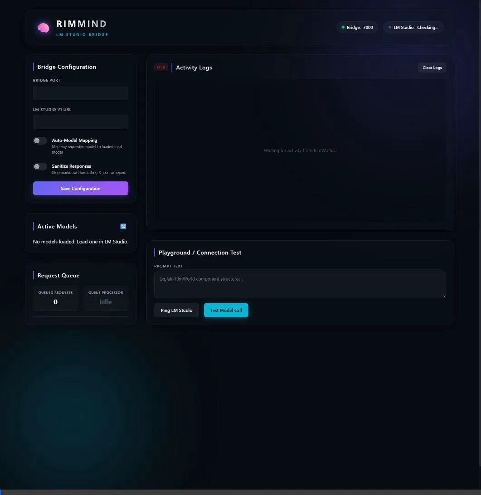
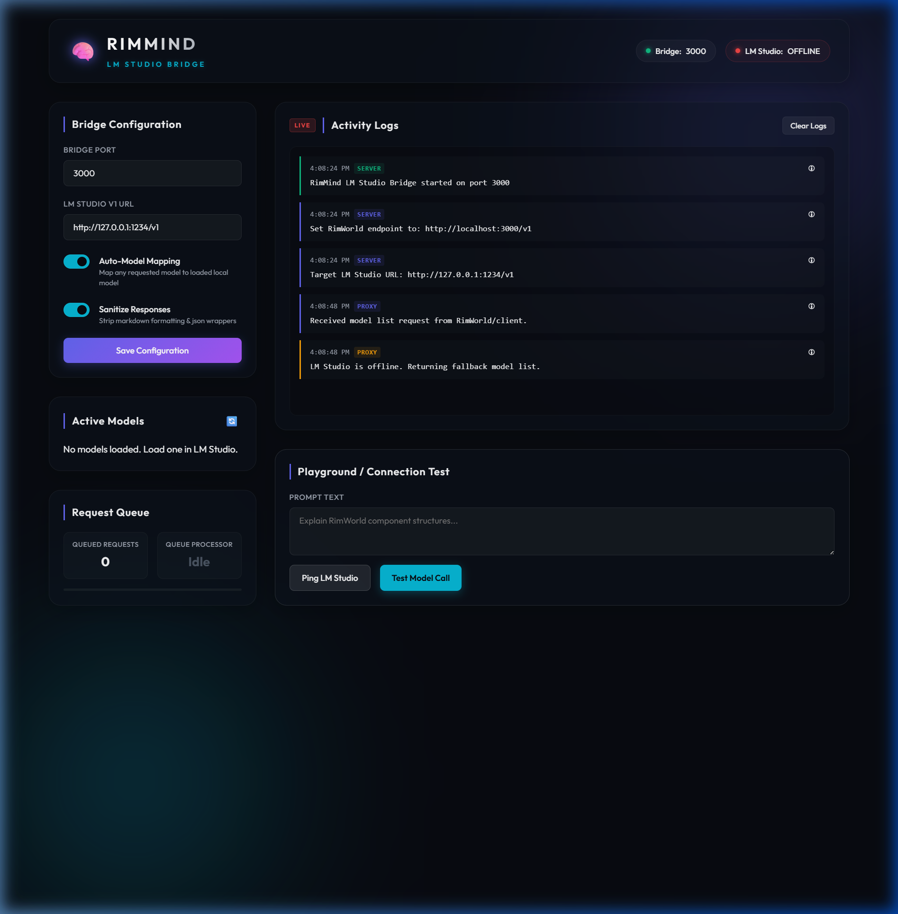

# 🧠 RimMind LM Studio Bridge

An elegant, secure, and robust HTTPS local bridge connecting the RimWorld mod **RimMind** (Core/Dialogue/Actions/Memory/Advisor) to local LLM backends like **LM Studio** and **Ollama**.

The bridge solves local LLM execution bottlenecks in RimWorld by introducing structured request queueing, auto-model mapping, C# response sanitization, and a premium glassmorphic dashboard for real-time monitoring and one-click integration.

---

## 📸 Dashboard Overview



---

## 🚀 Key Features

* **🔒 Secure Local HTTPS**: Automatically generates a localhost SSL certificate trusted by Windows so browsers and mod clients establish secure connections with no warning prompts.
* **⚡ Request Concurrency Control**: Implements a single-concurrency request queue. Local backends running on consumer GPUs are protected against parallel thread requests (e.g. dialogue events trigger sequentially, preventing GPU lockups).
* **🤖 Auto-Model Mapping**: Scans your active model list in LM Studio and automatically redirects any incoming API completions to your loaded model, bypassing the need to copy-paste long model names.
* **🧹 Response Sanitization**: Automatically strips markdown json decorators (` ```json ` wrappers) from the LLM outputs to guarantee they parse cleanly in RimWorld-Core's C# client.
* **🔗 One-Click RimWorld Configuration**: Automatically detects Ludeon Studios' local appdata settings directory, locates the RimMindCoreMod XML file, and configures the endpoint and key parameters with a single click.
* **📊 SSE Log Streaming**: Real-time event logging (prompts, completion times, token counts) streamed directly to the browser dashboard using Server-Sent Events.

---

## 🛠️ Getting Started (End-User Setup)

### Quick Start (Windows)
1. Download and extract this repository.
2. Double-click the **[launch.bat](launch.bat)** script.
3. If this is the first run:
   - It will automatically install dependencies (`npm install`).
   - It will open a Windows PowerShell prompt to generate and register your localhost SSL certificate. Click **Yes** when Windows asks to trust the root certificate.
4. The launcher will automatically start the backend and open the dashboard in your browser: `https://localhost:3000`.

---

## 🎮 Linking with RimWorld

### Method 1: The One-Click Way (Recommended)
1. Make sure RimWorld is closed (or you will need to restart it afterwards).
2. Open the bridge dashboard at `https://localhost:3000`.
3. In the sidebar, look for the **RimWorld Link** panel.
4. Click **Link Mod Settings** (or **Auto-Configure Settings**).
5. The bridge will directly modify RimWorld's local config files to establish the connection!



### Method 2: Manual Configuration
In RimWorld, open **Options → Mod Settings → RimMind-Core** and configure:
* **API Endpoint**: `https://localhost:3000/v1`
* **API Key**: `rimmind-bridge`
* **Model Name**: Any text (e.g. `auto` — the bridge will map it to your active loaded model)

---

## 🛠️ Architecture & Files

```
rimmind-lmstudio-bridge/
├── server.js              # Express HTTPS proxy server & auto-linker API
├── package.json           # Dependencies & scripts
├── launch.bat             # Auto-installer & launcher (double-click)
├── setup-certs.ps1        # Local SSL certificate generator
├── certificate.pfx        # Generated PFX certificate (git-ignored)
├── config.json            # Persisted runtime settings (git-ignored)
├── images/                # Dashboard media assets
└── public/
    ├── index.html         # Dashboard HTML layout
    ├── style.css          # Glassmorphic cosmic styling
    └── app.js             # SSE & UI configuration scripting
```

---

## ❓ Troubleshooting

### Connection to LM Studio is Offline
- Make sure LM Studio is running.
- Ensure the **Local Server** option is enabled inside LM Studio (usually listening on port `1234`).
- If you have authentication enabled in LM Studio, enter your API key in the **LM Studio API Key** field on the bridge dashboard.

### Dashboard shows Certificate Warning
- If the browser displays a warning, the root certificate was not trusted during setup.
- Run `npm run setup-certs` again in the console and ensure you click **Yes** to trust the certificate.
